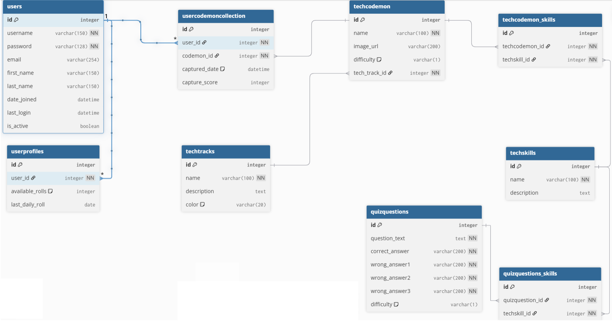

# CodeMon - Learn Tech Skills, Collect Pokemon!

A mobile-first, gamified learning platform where users master tech concepts by "battling" Pokemon through AI-generated quizzes. Prove your knowledge to capture Pokemon and build your tech collection!

## 🎯 The Concept
**Battle → Capture → Collect!** 

- **Battle**: Face Pokemon in skill-based quiz battles
- **Capture**: Prove your knowledge to add Pokemon to your collection  
- **Collect**: Build your tech Pokemon portfolio across learning tracks

## 🚀 Live Demo
[Deployed Link Will Be Here]

## 📋 Table of Contents
- [Features](#features)
- [Technologies](#technologies)
- [Installation](#installation)
- [Learning Tracks](#learning-tracks)
- [Game Mechanics](#game-mechanics)
- [Project Structure](#project-structure)
- [Development Phases](#development-phases)

## ✨ Features

### 🎮 Core Gameplay
- **Track-Based Enrollment** - Choose learning paths (Web Dev, Cybersecurity, etc.)
- **Skill-Based Encounters** - Each Pokemon represents specific tech skills
- **AI-Generated Quizzes** - Dynamic quizzes based on Pokemon skills
- **Prove-to-Capture** - Score 80%+ in battles to collect Pokemon
- **Roll Economy** - Earn rolls through learning activities

### 📚 Learning System
- **Multiple Tech Tracks**: Web Dev, Data Science, Cybersecurity, DevOps
- **Personalized Quizzes**: AI-generated based on encountered Pokemon skills
- **Progressive Difficulty**: Beginner → Intermediate → Advanced Pokemon
- **Track Progression**: Unlock new tracks as you advance

### 📱 Mobile-First Design
- **Responsive** - Works seamlessly on all devices
- **Touch-Optimized** - Designed for mobile interaction

## 🛠 Technologies

### Backend
- **Python** + **Django**
- **PostgreSQL** database
- **AI Integration** for dynamic quiz generation

### Frontend
- **HTML5**, **CSS3**, **JavaScript**
- **Django Templates**
- **Mobile-first** CSS architecture

## 🎯 Learning Tracks

### 🔵 Web Development
- HTML/CSS Fundamentals
- JavaScript & DOM Manipulation  
- React/Vue.js Concepts
- Django Framework

### 🔴 Cybersecurity
- Network Security Basics
- Cryptography Concepts
- Security Best Practices
- Ethical Hacking Principles

### 🟢 Data Science
- Python Basics
- Pandas & Data Analysis
- Machine Learning Concepts
- SQL & Database Fundamentals

### 🟠 DevOps
- Linux Basics
- Containerization (Docker)
- CI/CD Pipelines
- Cloud Infrastructure

## 🎮 Game Mechanics

### User Journey:
1. **Sign Up & Choose Track** → Select your learning path
2. **Earn Rolls** → Daily logins, content completion, achievements
3. **Encounter Pokemon** → Use rolls to find Pokemon from your enrolled tracks
4. **Battle Quiz** → AI generates quiz based on Pokemon's skills
5. **Capture** → Score 80%+ to add Pokemon to your collection
6. **Progress** → Unlock new tracks and encounter harder Pokemon

### Example Pokemon:
- **HTMLizard** (Web Dev) - Skills: "HTML5, Semantic Tags, Forms"
- **Cryptorby** (Cybersecurity) - Skills: "Encryption, Hashing, SSL"
- **Pythorch** (Data Science) - Skills: "Python, Pandas, Data Analysis"
- **Dockerchu** (DevOps) - Skills: "Containers, Docker, Orchestration"

## 🗃️ Database Schema



## 🚀 Quick Start
### Prerequisites
- Python 3.8+
- PostgreSQL
- Django 4.2+

### Installation
1️⃣ **Install PostgreSQL locally**

- If you don’t already have it, you need to install PostgreSQL itself:

- Download PostgreSQL

- During setup, note your username, password, and port (usually 5432)

- Ensure the service is running (you can test with SQL Shell or pgAdmin)

2️⃣ **Cloning and environment Setup**
```bash
# Clone the Capstone Project repository
git clone https://github.com/SaeedJBI/Capstone-Project.git
cd Capstone-Project

# Navigate to the CodeMon Django project
cd codemon

# Set up virtual environment
python -m venv venv
source venv/bin/activate  # Windows: venv\Scripts\activate

# Install dependencies
pip install -r requirements.txt

# Preferred Database management system: PostgreSQL
# Set up database: on SQL Shell (psql)
CREATE DATABASE codemon;

# Run migrations
python manage.py migrate

# Start development server
python manage.py runserver
```
3️⃣ **Configure Database Settings in Django**

After creating the codemon database in SQL Shell, you need to tell Django to use it.

- Open: codemon/settings.py

- Find the **DATABASES** section and edit it like this:
```bash
DATABASES = {
    'default': {
        'ENGINE': 'django.db.backends.postgresql',
        'NAME': 'codemon',
        'USER': 'postgres',       # your PostgreSQL username
        'PASSWORD': 'your_password', # your password
        'HOST': 'localhost',
        'PORT': '5432',
    }
}
```
4️⃣ **Ensure your django project is successfully connecting to the DB by running the server**

5️⃣ **Insert the dummy data**
run: 
```bash
python manage.py load_dummy_data
```
6️⃣ **Run makemigrations (before migrate)**
```bash
python manage.py makemigratoins # this also ensures your connection witht the DB is successful
# then run
python manage.py migrate
```
7️⃣ **Create a Superuser (for admin panel)**
```bash
python manage.py createsuperuser
```
- Then follow the prompts to create it
- Run the server and visit **http://localhost:8000/admin/** to login
- Make sure all the models are created and they contain the dummy data

